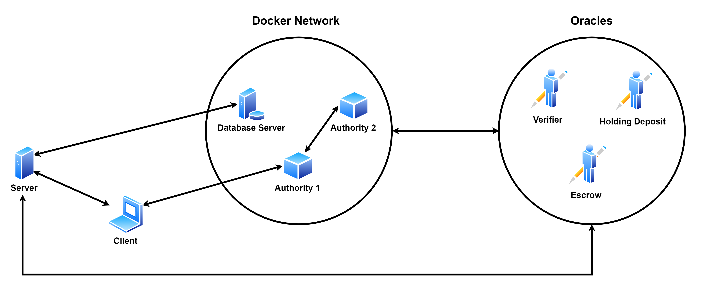
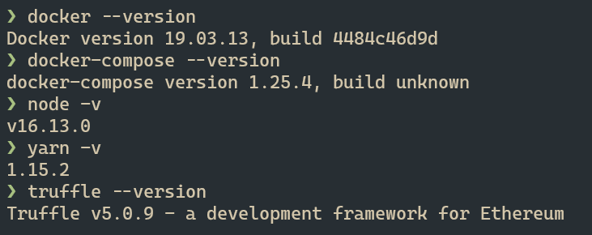
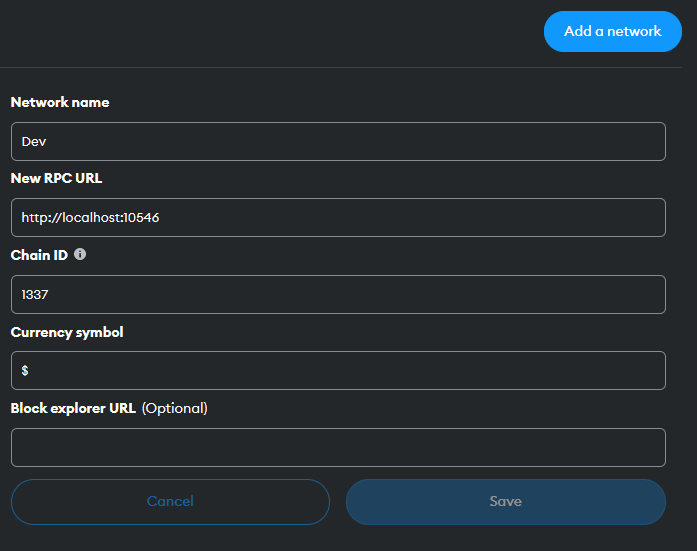

# Final Year Project

Leveraging the use of blockchain and smart contract technology to facilitate real-estate property transactions.


# Table of contents

1. [Overview](#overview)
2. [Project Setup](#project-setup)
3. [Usage](#usage)
4. [Video Demonstration](#video-demo)

## Overview <a name="overview"></a>

### What

The focus of this project was to develop a _proof of concept_ digital platform that simulates the processes of buying and selling property, in the residential real-estate industry, using blockchain and smart contract technology.

### Why

The current processes of buying, selling and renting property are carried out for the most part by third party real-estate agents. As a result of this, there is an element of trust required from the transacting parties (buyers, sellers, landlords & tenants).

This trust gives rise to various problems that affect the speed, cost and security of the real estate transaction processes. A few of these problems are:-

- Property fraud
- Inaccurate market statistics
  - Can result in slow price discovery for sellers and buyers
- Exposure of the transacting parties personal data
- Inaccessible property information
  - E.g. Maintenance records
  - Sometimes this information is also kept behind paywall of sorts
- Amount of time elapsed between commencing and concluding a real estate transaction
- High middlemen costs for processing applications

Blockchain and smart contract technology are inherently capable of addressing some of the above problems. For instance:-

- The blockchain's immutability can deal with fraud attempts.
- Similarly, its provenance can address issues with certain information previously being inaccessible.
- By combining a peer-to-peer model of transacting with the advances in cybersecurity, issues surrounding the exposure of personal data can be handled. This can also lead to a reduction in costs that would otherwise be paid to middlemen, by instead having them paid to keep the network alive.
- With advances to the speed and volume of blockchain transactions handled, there can be a reduction to the overall time elapsed in a property transaction.

It is because of these potential improvements to the current system that I chose to base my final year project around the domain of residential real-estate.

### How

To achieve the main aim of this project I defined 4 main objectives, which were:-

1. Setup a private Ethereum network that utilizes Proof-of-Authority consensus
2. Design, write, compile and deploy the smart contracts responsible for key activities in a modified version of the real estate transaction process, onto the private network.
3. Design and develop a partially decentralized web application (dApp) that will allow buyers and sellers to interact with the private Ethereum network and the deployed smart contracts.
4. Test the platform's functionality by simulating a real estate transaction between a buyer and seller, from start to finish.

These objectives resulted in the following platform architecture:-



The main elements of this architecture were developed using the following technologies:-

1. Client - VueJS
2. Server - ExpressJS
3. Storage - MongoDB
4. Oracles - NodeJS
5. Network - Docker (Geth nodes + MongoDB server)
6. Smart Contracts
   - written using Solidity
   - compiled and deployed using the Truffle framework

<br>

## Project Setup <a name="project-setup"></a>

### Platform, Software & Tool Requirements

> Updated (2023)

I tested the project using the following software versions:



For Metamask, you can simply use the latest version available.

If you're wondering how to install `yarn v1.15.2 or truffle 5.0.9`, run the
following:

```bash
npm install -g yarn@1.15.2
npm install -g truffle@5.0.9
```

#### Operating Systems Tested

1. Ubuntu 18.04 - Windows Subsystem for Linux (WSL)
2. Ubuntu 16.04
3. macOS - High Sierra

#### Web Browsers Tested

1. Firefox Quantum - v66.0.5 (64-bit)
2. Brave Browser - v0.64.76
3. Google Chrome - v74.0.3729.157 (64-bit)

### Setup Instructions

1. Ensure you have installed the software mentioned above

   - Try to use the same versions that I have, as this project was developed 4
     years ago a lot has changed since then, so using later versions might pose
     some issues

2. Navigate to the `network` directory

   - Run: `docker-compose build`
   - Run: `docker-compose up -d`
   - Run: `docker ps -a` and confirm that there are 4 containers running (auth1, auth2, bootnode, mongodb_server)
   - Verify that the authority nodes are up & mining: `docker logs --tail 15 auth1`
   - Navigate back to the root directory

3. Navigate to the `contracts` directory

   - Run: `truffle migrate --network development --reset`
   - Navigate back to the root directory

4. Start the client

```bash
cd client
yarn install --ignore-engines
yarn serve
```

5. Start the server

```bash
cd server
yarn install --ignore-engines
yarn dev
```

6. Start the oracles

```bash
cd oracles
yarn install --ignore-engines

# In 3 separate terminal sessions, run:
yarn run verifier
yarn run hd
yarn run escrow
```

7. There should be a total of 5 node processes running after steps 4-6

   - Client, Server, 3 Oracles (Verifier, HD, Escrow)

8. Proceed to open up 2 **_different_** web browsers.

   - I will assume `Browser A = Firefox` and `Browser B = Chrome`.

9. In Browser A,

   - Ensure you have installed and configured the Metamask browser extension/plugin.
   - Navigate to `http://localhost:8080`
   - Click `Register` in the bottom-left
   - You will be prompted to connect the app to Metamask, accept & proceed
   - Open the Metamask extension
     - Navigate to Settings > Networks > Add a network
     - Fill in the details as follows:
     - 
     - Switch to the newly added `Dev` Network
       - You should see a balance of $1,000,000

10. Repeat Step 9 for Browser B
11. You will now have 2 browsers, both of which will have Metamask configured to connect to an authority node in the private ethereum network
12. Proceed to use one browser as the `Buyer` and the other as the `Seller`

#### Additional Info

1. The web application was designed to support any resolution above 1920x1080. For resolutions lower than this or if any interface appears to clip past the screen, please try decreasing the browser's zoom level.
2. If when executing any of the installation based code above, there appear any errors with regards to the absence of tools such as Make, please try installing the essential build tools package: `sudo apt-get update && apt-get install -y build-essential`.

<br>

## Usage <a name="usage"></a>

A typical residential real-estate transaction begins when a property is listed on the market and offers can be made towards it. Usage of this platform was designed to mimic that, however before a property can be listed, the seller must have it verified.

An example transaction from start to finish proceeds as follows:-

| Buyer                                                                                                                                  | Both                                                                                                                                                                                                                               | Seller                                                                                                                                                                                                |
| -------------------------------------------------------------------------------------------------------------------------------------- | ---------------------------------------------------------------------------------------------------------------------------------------------------------------------------------------------------------------------------------- | ----------------------------------------------------------------------------------------------------------------------------------------------------------------------------------------------------- |
|                                                                                                                                        | Both parties register with the platform.                                                                                                                                                                                           |                                                                                                                                                                                                       |
|                                                                                                                                        |                                                                                                                                                                                                                                    | The seller proceeds to add details about their property.                                                                                                                                              |
|                                                                                                                                        |                                                                                                                                                                                                                                    | Before this property can be listed on the platform, it needs to be verified.                                                                                                                          |
|                                                                                                                                        |                                                                                                                                                                                                                                    | The seller requests verification by uploading a copy of their title deed.                                                                                                                             |
|                                                                                                                                        |                                                                                                                                                                                                                                    | Once verification is obtained, the seller can now choose to list their property.                                                                                                                      |
| The buyer searches for properties on the platform.                                                                                     |                                                                                                                                                                                                                                    |                                                                                                                                                                                                       |
| When they find a property they like, they submit an offer towards it.                                                                  |                                                                                                                                                                                                                                    |                                                                                                                                                                                                       |
|                                                                                                                                        |                                                                                                                                                                                                                                    | The seller is able to view submitted offers towards their property and select one to proceed further with.                                                                                            |
|                                                                                                                                        |                                                                                                                                                                                                                                    | When an offer is selected, it creates a session between the buyer and seller.                                                                                                                         |
|                                                                                                                                        |                                                                                                                                                                                                                                    | Stage 1 of the session involves having the seller acquire a holding deposit from the buyer towards the property. This is done by having the seller make a request with the deposit amount + deadline. |
| The buyer pays the holding deposit.                                                                                                    |                                                                                                                                                                                                                                    |                                                                                                                                                                                                       |
|                                                                                                                                        |                                                                                                                                                                                                                                    | The seller obtains verification of the buyer.                                                                                                                                                         |
|                                                                                                                                        |                                                                                                                                                                                                                                    | The seller uploads the sales contract.                                                                                                                                                                |
| The buyer signs and uploads the signed sales contract.                                                                                 |                                                                                                                                                                                                                                    |                                                                                                                                                                                                       |
|                                                                                                                                        |                                                                                                                                                                                                                                    | The seller can then choose to continue to the final stage of the session.                                                                                                                             |
|                                                                                                                                        |                                                                                                                                                                                                                                    | The seller uploads the title transfer document and creates the escrow.                                                                                                                                |
| The buyer can download the title transfer document and then simultaneously approve and deposit the final payment towards the property. |                                                                                                                                                                                                                                    |                                                                                                                                                                                                       |
|                                                                                                                                        |                                                                                                                                                                                                                                    | Once the seller sees that the final deposit was made, they can request the final title transfer.                                                                                                      |
|                                                                                                                                        | Both parties receive a draft copy of the final title deed, to which they are required to indicate their acceptance/rejection of its contents.                                                                                      |                                                                                                                                                                                                       |
|                                                                                                                                        | When the smart contract receives two greenlights for the draft title deed's contents, it will carry out the final disbursement by sending the buyer a finalized copy of the property title deed and the seller, the final payment. |                                                                                                                                                                                                       |

> Note:- Due to the scope of the final year project, I have chosen to only implement the use case wherein both parties are in complete agreement throughout all phases of the real-estate transaction.
> This is not true for many real-estate transactions that take place in the real industry today and such cases need to be treated with care as funds are held wthin smart contracts.

## Video Demonstration <a name="video-demo"></a>

A demo run of the entire platform simulating a real estate transaction can be seen at: https://youtu.be/it1gYBL2Uf8.
